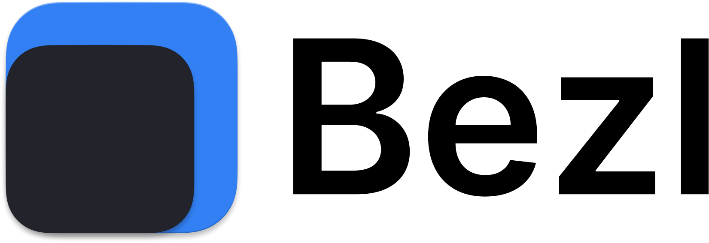
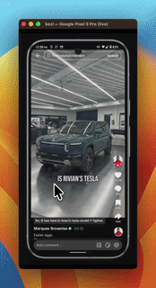

<p align="center">
  
</p>

<p align="center">
  <a href="https://www.npmjs.com/package/@damunga/bezl"></a>
  <a href="https://www.npmjs.com/package/@damunga/bezl"></a>
  <a href="LICENSE"></a>
  <a href="https://nodejs.org"></a>
  
</p>

<p align="center">
  wrap android screen recordings in a realistic device frame —<br/>
  post-process an existing file or record live with the frame applied in real-time.
</p>

<p align="center">
  
</p>

```
bezl recording.mp4
# → recording-framed.mp4 with a Pixel 9 Pro frame auto-detected

bezl screenshot.png
# → screenshot-framed.png (static image, no FFmpeg required)
```

## Dependencies

bezl relies on a few system tools. Install them before using bezl.

### macOS (Homebrew)

```bash
# Required — video processing
brew install ffmpeg

# Required for `bezl record` — ADB device communication
brew install android-platform-tools

# Optional — enables audio capture on Android 11+ via `--scrcpy`
brew install scrcpy
```

### Linux

```bash
# Required
sudo apt install ffmpeg adb      # Debian/Ubuntu
sudo dnf install ffmpeg android-tools  # Fedora

# Optional
sudo apt install scrcpy
```

### Node.js

Node.js **18 or later** is required. Check your version with `node -v`.
Install via [nodejs.org](https://nodejs.org) or `brew install node` on macOS.

---

## Install

### Homebrew (macOS, recommended)

```bash
brew tap davidamunga/bezl
brew install bezl
```

This also installs Node.js if you don't already have it. You still need `ffmpeg` and `adb` (see [Dependencies](#dependencies) above).

### npm (global)

```bash
npm install -g @damunga/bezl
```

### Run without installing

```bash
npx @damunga/bezl recording.mp4
```

### From source

```bash
git clone https://github.com/davidamunga/bezl.git
cd bezl
npm install
npm link          # makes `bezl` available globally
```

## Usage

There are two modes: **process** an existing recording, or **record** live with the frame applied in real-time.

### `bezl process <input>` — post-process a recording or screenshot

Accepts video files (`.mp4`, `.mkv`, …) and static images (`.png`, `.jpg`, `.webp`).

```
bezl process <input> [options]

Arguments:
  input                   Path to a screen recording or screenshot

Options:
  -o, --output <path>     Output file (default: <input>-framed.{mp4,png})
  -f, --frame <name>      Device frame (default: auto-detected)
  -c, --color <scheme>    Frame color: dark | light  (default: dark)
  -s, --scale <factor>    Output scale multiplier, e.g. 0.5 = half size
      --speed <factor>    Playback speed multiplier, e.g. 1.2 = 20% faster (video only)
      --crf <number>      H.264 quality 0–51, lower = better (default: 18)
      --preset <name>     FFmpeg preset: ultrafast→veryslow (default: fast)
      --force             Regenerate frame PNG even if cached
      --list              List available device frames
```

```bash
bezl process recording.mp4
bezl process screenshot.png
bezl process recording.mp4 --frame pixel-9-pro
bezl process recording.mp4 --color light --scale 0.5 -o demo.mp4
```

### `bezl record [output]` — live recording

Records from a connected Android device, applies the device frame in
real-time, and shows a **live framed preview** in a window.

```
bezl record [output] [options]

Arguments:
  output                        Output file (default: recording-framed-<timestamp>.mp4)

Options:
      --serial <id>             Target a specific ADB device serial
      --no-display              Disable the live framed preview window
      --scrcpy                  Use scrcpy as source (enables audio on Android 11+)
      --screenrecord-args <s>   Extra args for screenrecord/scrcpy, space-separated
  -f, --frame <name>            Device frame (default: auto-detected from device)
  -c, --color <scheme>          Frame color: dark | light  (default: dark)
  -s, --scale <factor>          Output scale multiplier
      --crf / --preset          libx264 quality (ignored when hardware encoding is used)
```

```bash
# Record with live framed preview — Ctrl+C to stop
bezl record

# With audio (requires scrcpy + Android 11+)
bezl record demo.mp4 --scrcpy

# No preview, limit to 60 seconds
bezl record demo.mp4 --no-display --screenrecord-args "--time-limit=60"

# Specific device
bezl record --serial PT19655JA1222400122
```

**Default pipeline (ADB, video only):**

```
adb exec-out screenrecord --output-format=h264 /dev/stdout
  │  raw H.264 bitstream
  ▼
FFmpeg  [h264_videotoolbox on macOS / libx264 elsewhere]
  │  scale → pad → overlay frame
  ├──► output.mp4          (file on disk)
  └──► UDP:12xxx → ffplay  (live framed preview)
```

**With `--scrcpy` (video + audio):**

```
scrcpy --no-playback --record=- --record-format=mkv
  │  MKV: H.264 video + AAC audio
  ▼
FFmpeg  [same frame overlay + audio passthrough]
  ├──► output.mp4  (video + audio)
  └──► UDP preview
```

**Limitations:**

- scrcpy mode: audio requires Android 11+ and scrcpy 2+, no time limit
- Requires Android 5.0+ (API 21)

## Available frames

Run `bezl --list` to see the full list with frame dimensions.

| Key               | Device                 | Screen resolution | Frame quality        |
| ----------------- | ---------------------- | ----------------- | -------------------- |
| `pixel-9-pro`     | Google Pixel 9 Pro     | 1080×2424 (20:9)  | Photo-quality PNG    |
| `pixel-9-pro-xl`  | Google Pixel 9 Pro XL  | 1344×2992 (20:9)  | Photo-quality PNG    |
| `pixel-8-pro`     | Google Pixel 8 Pro     | 1344×2992 (20:9)  | Photo-quality PNG    |
| `pixel-8`         | Google Pixel 8         | 1080×2400 (20:9)  | Photo-quality PNG    |
| `samsung-s21`     | Samsung Galaxy S21     | 1080×2400 (20:9)  | Photo-quality PNG    |
| `generic`         | Generic Android        | 1080×1920 (16:9)  | SVG vector (no download) |

Auto-detection matches your video's aspect ratio to the closest frame. If your device isn't listed, `pixel-9-pro` works well for most modern 20:9 phones.

## How it works

1. **Frame preparation** — device frames come from two sources, both cached in `~/.cache/bezl/`:
   - **Real device PNGs** (most frames) — downloaded once from an open-source CDN and cached locally. Photo-quality renders with accurate bezels, cameras, and buttons.
   - **SVG-generated** (`generic`) — rendered locally by [sharp](https://sharp.pixelplumbing.com). No download required.

2. **Video compositing** — FFmpeg:
   - Scales your recording to fit the frame's screen area (letterboxes if the aspect ratios differ slightly).
   - Places the scaled video onto a black canvas at the screen position.
   - Overlays the device frame PNG on top (the transparent hole lets the video show through).
   - Audio is copied through losslessly.
   - On macOS, uses the Apple hardware encoder (`h264_videotoolbox`) for ~5-10× faster encoding.

3. **Image compositing** (PNG/JPG/WebP input) — handled entirely by [sharp](https://sharp.pixelplumbing.com), no FFmpeg required:
   - Scales the screenshot to fit the screen area, centers it.
   - Composites it under the device frame PNG.
   - Outputs a lossless PNG.

## Adding custom frames

Define a new entry in `src/frames.js`. Two source types are supported:

**PNG from URL** (preferred — photo-quality):
```js
'my-device': {
  name: 'My Device',
  desc: '1080×2400 (20:9) — Real device frame',
  source: 'url',
  ratios: [1080 / 2400],
  colors: {
    dark:  { url: 'https://…/frame-dark.png', screen: { x, y, width, height }, frameSize: { width, height } },
    light: { url: 'https://…/frame-light.png', screen: { x, y, width, height }, frameSize: { width, height } },
  },
},
```

**SVG-generated** (no download, vector):
```js
'my-device': {
  name: 'My Device',
  source: 'svg',
  ratios: [9 / 16],
  build: (scheme) => ({
    svg: `<svg …>…</svg>`,  // must have a transparent screen hole via <mask>
    frameSize: { width, height },
    screen: { x, y, width, height },
  }),
},
```

Key fields in both types:
- `screen` — `{ x, y, width, height }` of the transparent screen area inside the frame PNG
- `frameSize` — `{ width, height }` of the full frame canvas
- `ratios` — array of `w/h` aspect ratios used for auto-detection

## License

[MIT](LICENSE) © [David Amunga](https://github.com/davidamunga)
